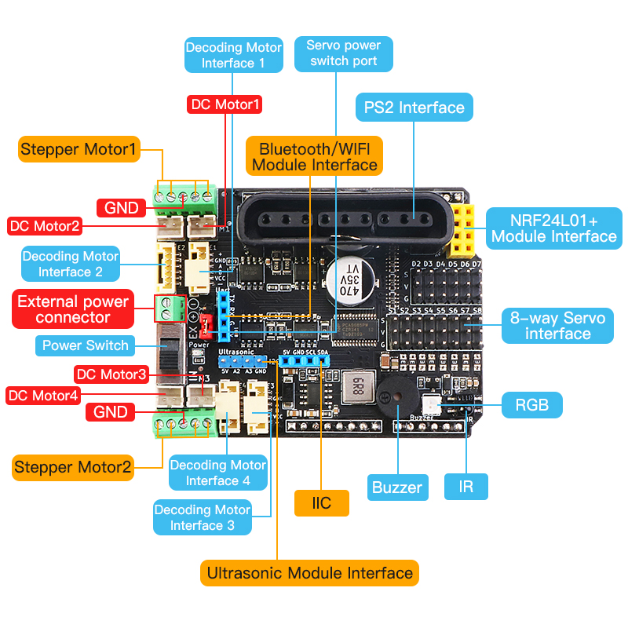
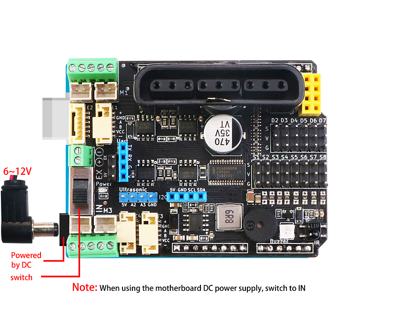
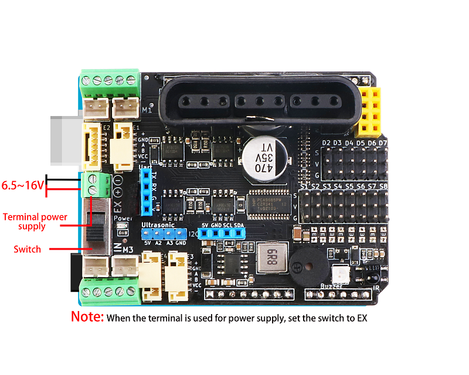
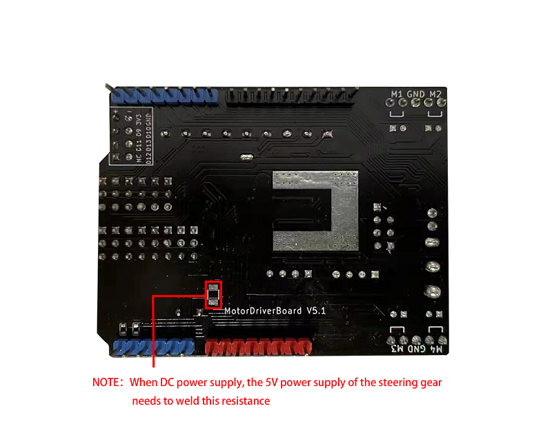
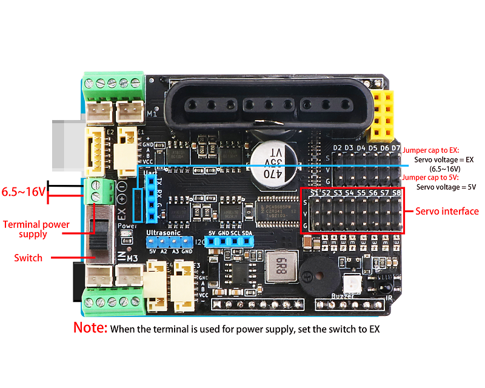
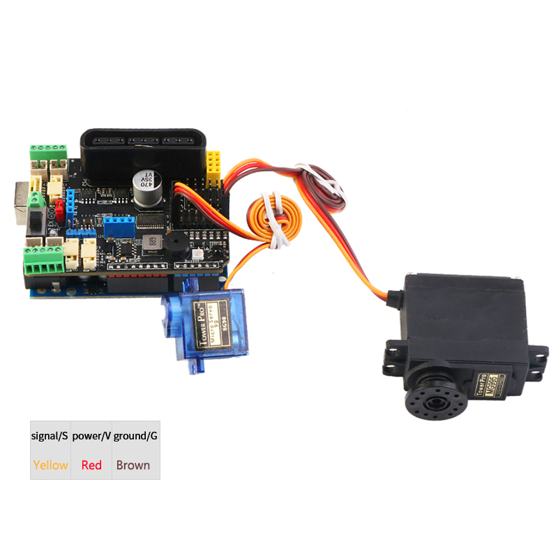

# MotorDriverBoard
[中文版](README_zh.md)

MotorDriverBoard is a multi-function motor drive expansion board developed by [Shenzhen Emake Space Technology Co., Ltd.] (www.emakefun.com), specifically for Arduino Uno (compatible with Mega2560) robot, motor drive, and multi-channel steering gear control. This driver board adopts I2C mode control [PCA9685](./doc/pca9685.pdf) (16-channel PWM output chip). Therefore, there is no corresponding relationship between the drive board motor or steering gear and the arduino port. It is controlled by I2C extended PWM control. For details, please see[Schematic diagram of the driver board](./doc/MotorDriverBoard_V5.1.pdf).

MotorDrvierBoard for Arduino  UNO(Arduino Mega2560) 


## Features
- Support 4 DC motors with a maximum drive current of 3A
- Support to drive 8 steering gears, with self-recovery fuses to prevent the steering gear from blocking
- Support driving 2-way 4-wire stepper motors
- Support 4 way encoding motor
- Onboard passive buzzer
- Onboard 1 RGB full-color light
- Onboard infrared receiver
- 1 i2c interface, 1 PS2X interface, 1 Uart (Bluetooth/wifi module) interface, 1 NRF24L01 module interface
- 1 ultrasonic module interface
- The steering gear power supply can be switched to external power supply
- Software supports Arduino IDE, Mixly, MagicBlock(Scratch3.0)


## Hardware function introduction
### Front


### Power supply instructions
- powered by DC



- Terminal power supply



- The steering gear is powered by the on-board DC-DC power supply

 



- The steering gear adopts external power supply



## Driver library use


## Basic sample program
[**gpiotest**](examples/gpiotest/gpiotest.ino) Control the PCA9685 output port as a normal IO port to output high and low levels

```c++
gpio.begin(1000);  		/*Initialize the output frequency of the io port to 1KHz*/
gpio.setPin(S1, HIGH);  /*Pin S1 (S1~S8) output high level*/
gpio.setPin(S1, LOW);  	/*Pin S1(S1~S8) output low level*/
```

  

[**pwmtest**](examples/pwmtest/pwmtest.ino) This sample program is to control PCA9685 output port to output PWM waveform

```c++
pwm.begin(1500);  			/*Initialize the output frequency of the io port to 1500Hz*/
pwm.setPin(S1, 1024); 		/*Pin 1 outputs a PWM wave with a duty ratio of 1024/4096 (0~4096)*/

[dc](examples/dc/dc.ino)	/*4 DC motor test program*/

mMotor.begin(50); 			/*Initialize the output frequency of the io port to 50Hz*/
DCMotor_1->setSpeed(200); 	/*Set the speed to 200*/
DCMotor_1->run(FORWARD); 
/*Control the running state of the motor (FORWARD (front), BACKWARD (rear), BRAKE (stop))*/
```

**Wiring diagram**

[**servo**](examples/servo/servo.ino)Eight-way steering gear test program

```c++
mMotorDriver.begin(50); 		/*Initialize the output frequency of the io port to 50Hz*/
mServo1->writeServo(0); 		/*Set the servo angle 0~180*/
```

**Wiring diagram**

**Wiring diagram**

[**stepper**](examples/stepper/stepper.ino) Stepper motor test program

```c++
Emakefun_StepperMotor *StepperMotor_1 = mMotorDriver.getStepper(1, 200);  
/*Initialize stepper motor 1, 42 stepper motor takes a step of 1.8 degrees, so the number of steps in a circle is 200*/

mMotorDriver.begin(1526); 			/*Set the frequency to the maximum 1526HZ*/

StepperMotor_1->setSpeed(400);  	/*Set the number of revolutions of the stepper motor to 400 revolutions per minute*/

StepperMotor_1->step(200, FORWARD, DOUBLE); 
/*Drive the stepper motor in DOUBLE (full step) mode, FORWARD (forward) 200 steps. */

  /*Stepper motor drive modes: full-step DOUBLE, single-step SINGLE, 1/2 step INTERLEAVE, 1/16 step MICROSTEP these four drive modes (please refer to relevant information for the driving principle of stepping motor). It is recommended to use 1/16 step mode. */
```

**Wiring diagram**

[**encoder**](examples/encoder/encoder.ino)4-channel DC motor test program

```c++
mMotorDriver.begin(); 				/*Initialize the output frequency of the io port and default to the maximum*/
EncodeMotor_1->setSpeed(100); 		/*Set the speed to 100*/
EncodeMotor_1->run(BACKWARD);
/*Control the running state of the motor (FORWARD (front), BACKWARD (rear), BRAKE (stop))*/
```

使用PID控制编码电机速度

```c++
PID myPID(&Input, &Output, &Setpoint, Kp, Ki, Kd, DIRECT);
```

- Input: PID input (encoding motor speed)
- Output: PID output (encoding motor speed)
- Setpoint: the target value of PID
- Kp: PID proportional coefficient
- Ki: integral coefficient of PID
- Kd: Differential coefficient of PID
- DIRECT: direction parameter, the encoder motor rotates forward
- REVERSE: direction parameter, the encoder motor reverses

```c++
myPID.SetSampleTime(500); 			/*Set the PID sampling time to 500ms*/
myPID.SetMode(AUTOMATIC);  			/*Set PID mode to AUTOMATIC*/
```

```c++
Emakefun_EncoderMotor *EncodeMotor_1 = mMotorDriver.getEncoderMotor(1); /*Get Encoder Motor 1*/
mMotorDriver.begin(); 				/*Initialize the output frequency of the io port and default to the maximum*/
EncodeMotor_1->init(encoder1); 		/*Initialize encoder1 as the callback function of encoder motor 1 (calculate the pulse of the encoder disk)*/
MsTimer2::set(500, EncoderSpeed);  	/*Timer 2 obtains the encoder motor speed regularly*/
MsTimer2::start(); 					/*Start timer 2*/
```


**Wiring diagram**

## Comprehensive application

[PS2 control four-wheel drive car](examples/ps2ControlCar/ps2ControlCar.ino)

[PS2 control four-wheel drive mecanum wheel trolley](examples/ps2ControlMecanumWheel/ps2ControlMecanumWheel.ino)

[PS2 control four-wheel drive car plus robotic arm](examples/ps2ControlCarAndRoboticArm/ps2ControlCarAndRoboticArm.ino)

[Bluetooth (WIFI) control four-wheel drive car](examples/ble/ble.ino)

## Graphical programming block description

### MotorDriverBoard Programming graphics block
#### [mBlock5]()

#### Mixly

#### MagicBlock


