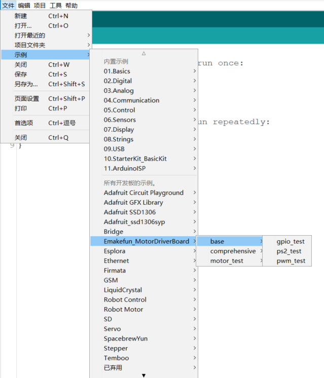

# MotorDriverBoard
[中文版](README_zh.md)

MotorDriverBoard is a multi-functional motor drive expansion board developed by [Shenzhen Yichuang Space Technology Co., Ltd.](www.emakefun.com) specially for Arduino Uno (compatible with Mega2560) robot, motor drive, and multi-channel servo control. This driver board adopts I2C mode control [PCA9685](./doc/PCA9685.pdf) (16-channel PWM output chip). Therefore, there is no corresponding relationship between the motor or servo of the driver board and the IO port of the arduino main board. The PWM control is extended through I2C. For details, please refer to [**Driver Board Schematic**](./doc/MotorDriverBoard_V5.1.pdf)

MotorDrvierBoard for Arduino  UNO(Arduino Mega2560) 


## quick link guide

[**Common problem**](#FAQ)
[**Arduino ide library file download**](https://github.com/emakefun/MotorDriverBoard/releases/download/v1.0/MotorDriverBoard.zip)
[**Mixly library download**](https://github.com/emakefun/MotorDriverBoard/releases/download/v1.0/MotorDriverBoard_Mixly.zip)
[**Mblock5 library download**](https://github.com/emakefun/MotorDriverBoard/releases/download/v1.0/MotorDriverBoard_Mblock5.zip)
[Mind+ library download]()
[MagicBlock Download]()


## Features
- Support 4-way DC motor, the maximum driving current is 3A
- Support to drive 8-way steering gear, with self-recovery fuse to prevent the steering gear from stalling
- Supports driving 2-way 4-wire stepper motors
- Support 4-way encoding motor
- Onboard passive buzzer (**A0**)
- Onboard 1 RGB full color light (**A1**)
- Onboard infrared receiver
- 1 i2c interface, 1 PS2X interface, 1 Uart (Bluetooth/wifi module) interface, 1 NRF24L01 wireless module interface
- 1 ultrasonic module interface
- Servo power supply can be switched to external power supply
- Software supports Arduino IDE, Mixly, Mind+, Mblock5, MagicBlock (customizable based on Scratch3.0)


## Hardware function introduction
### Front display


In order to make the use of this driver board more flexible, to adapt to the requirements of different motors and servo drives, and to make the entire board run stably

We have designed the following power supply schemes. **Note that the driver board must be powered by a lithium battery or a UPS power supply above 8.4V 3A, not only the Uno motherboard usb power supply or dry battery power supply**


#### 1、Only through the single power supply of the Uno's DC (7~12V) head to the Uno main board, driver board, and servos at the same time.

Application Scenario:

  a. **DC motor is required to drive below 9V, such as TT motor building block motor, etc., plus sg90/mg90 steering gear**

  b. When the PS2 controls the 9V~12V motor, in order to ensure the continuous connection of the PS2, it is recommended to use a model aircraft battery or a high-current 21700 lithium battery, and the two 18650 power supply is unstable**

  c. The power switch reaches the **IN(DC)** position, and the jumper cap **short-circuits the 5V position**


#### 2、Only provide a single power supply to the driver board, Uno main board and steering gear through the binding post. Output the 5V power supply of the driver board to the Uno motherboard

Application scenarios

   a. When driving 4-way motors above 12V, such as 370 motors and 520 motors, the steering gear is a low-power steering gear such as sg90/mg90;

   b. When the power supply exceeds the 12V voltage of the Uno DC head, we need to use the terminal for power supply, and the power supply range is 6~25V;

   c. The power switch is turned to **EX**, the jumper cap is shorted to the **5V position**, and the **R24 resistor position** on the back needs to be shorted.


#### 3、The main board of Uno is powered by the DC head, and the servo is powered by the terminal independently.

Application scenarios

  a. When using MG995/MG996/DS3235/DS3238 and other large torque servos externally, when the number exceeds 2 (it needs to be tested according to the actual situation), we need to supply power to the servos independently

  b. The power supply voltage and current of the steering gear are provided according to the parameters of the steering gear

  c. The power switch reaches the **IN(DC)** position, and the jumper cap **short-circuits the EX position**


## Driver library use

[**Download arduino library**]()Place it in the libraries directory under the Arduino IDE installation directory, and then open the example program by clicking File-->Examples-->Emakefun_MotorDriverBoard.




## Basic sample program
[**gpiotest**](examples/gpiotest/gpiotest.ino) Control the PCA9685 output port as a normal IO port to output high and low levels

```c++
gpio.begin(1000);  		/*Initialize the output frequency of the io port to 1KHz*/
gpio.setPin(S1, HIGH);  /*Pin S1 (S1~S8) output high level*/
gpio.setPin(S1, LOW);  	/*Pin S1(S1~S8) output low level*/
```

  

[**pwmtest**](examples/pwmtest/pwmtest.ino) This sample program is to control PCA9685 output port to output PWM waveform

```c++
pwm.begin(1500);  			/*Initialize the output frequency of the io port to 1500Hz*/
pwm.setPin(S1, 1024); 		/*Pin 1 outputs a PWM wave with a duty ratio(0~4096) of 1024/4096 */

[dc](examples/dc/dc.ino)	/*4 DC motor test program*/

mMotor.begin(50); 			/*Initialize the output frequency of the io port to 50Hz*/
DCMotor_1->setSpeed(200); 	/*Set the speed to 200*/
DCMotor_1->run(FORWARD); 
/*Control the running state of the motor (FORWARD (front), BACKWARD (rear), BRAKE (stop))*/
```


[**ps2_test**](./arduino_lib/examples/base/ps2_test/ps2_test.ino) PS2 handle test program

PS2 handle pin description：

| PS2 handle pin | Arduino pins |
| -------------- | ------------ |
| DAT            | D12          |
| CMD            | D11          |
| SEL/ATT        | D10          |
| CLK            | D13          |

Please do not reverse the PS2 installation, the left is the correct installation, the right is the PS2 receiver reversed.


## Motor Test Example

#### [**DC**](./arduino_lib/examples/motor_test/dc/dc.ino) Four-way DC motor test program

```c++
Emakefun_MotorDriver mMotor = Emakefun_MotorDriver(0x60);
Emakefun_DCMotor *DCMotor_1 = mMotor.getMotor(M1);

void setup()
{
    Serial.begin(9600);
    mMotor.begin(50);   /*Initialize the output frequency of the io port to 50Hz*/
}

void loop()
{
  // FORWARD
  DCMotor_1->setSpeed(200);  /*Set the speed to 200, range 0~255*/
  DCMotor_1->run(FORWARD);   // A total of four states: FORWARD, BACKWARD, BRAKE, RELEASE
}
```

**Wiring diagram display** 


[**Servo**](examples/servo/servo.ino)Eight-way steering gear test program

```c++
Emakefun_MotorDriver mMotorDriver = Emakefun_MotorDriver(0x60);
Emakefun_Servo *mServo1 = mMotorDriver.getServo(1);
mMotorDriver.begin(50); 		/*Initialize the output frequency of the io port to 50Hz*/
mServo1->writeServo(0); 		/*Set the servo angle 0~180*/
```

**Wiring diagram display**


[**Stepper**](examples/stepper/stepper.ino) Stepper motor test program

```c++
Emakefun_StepperMotor *StepperMotor_1 = mMotorDriver.getStepper(1, 200);  
/*Initialize the stepper motor 1, 42, the stepper motor step is 1.8 degrees, so the number of steps in a circle is 200*/

mMotorDriver.begin(1600); 			/*Set the frequency to the maximum 1526HZ*/

StepperMotor_1->setSpeed(400);  	/*Set the number of revolutions per minute of the stepper motor to 400. The faster the speed, the smaller the torque. The speed should not be too low, otherwise it will shake seriously*/

StepperMotor_1->step(200, FORWARD, DOUBLE); 
/*Drive the stepper motor to move forward 200 steps in a single step. */

  /*The driving mode of the motor is full-step DOUBLE, single-step SINGLE, and 1/2-step INTERLEAVE (please refer to the relevant information for the driving principle of the stepping motor) */
```

**Wiring diagram**

**The parameter wiring of different stepper motors is not necessarily the same, please be sure to first determine the color of each wire of the stepper motor and the corresponding A+ A- B+ B-phase (or A B C D) relationship**The following diagram is for wiring reference only


[**Encoder**](examples/encoder/encoder.ino) Four-way coding motor test program

| type                    | parameter                                                    |
| ----------------------- | ------------------------------------------------------------ |
| Rotating speed          | Voltage 6V No-load current 70mA No-load axle speed 90RPM<br />Voltage 9V No-load current 150mA No-load axle speed 140RPM<br />Voltage 12V No-load current 190mA No-load axle speed 190RPM |
| Output square wave type | AB phase square wave                                         |
| base pulse              | 12PPR(The motor rotates once and outputs 12 pulses)          |
| Reduction ratio         | 1:90(The shaft rotates once and the motor rotates 90 times)  |

From the above parameters, it can be seen that a total of 90x12=1080 pulses need to be counted when the wheel rotates once.

```c++
mMotorDriver.begin(); 				/*Initialize the output frequency of the io port and default to the maximum*/
EncodeMotor_1->setSpeed(100); 		/*Set the speed to 100*/
EncodeMotor_1->run(BACKWARD);
/*Control the running state of the motor FORWARD , BACKWARD , BRAKE*/
```

Test that all four encoder motors can rotate. Open the serial port and we need to be able to print out the four pulse values of Encoder1Pulse, Encoder2Pulse, Encoder3Pulse, and Encoder4Pulse as follows, which proves that the encoder motors are working normally.

```c++
start
Encoder1Pulse:1
Encoder2Pulse:1
Encoder3Pulse:1
Encoder4Pulse:1
Encoder1Pulse:2
Encoder2Pulse:2
Encoder1Pulse:3
```

[**Encoder_pid**](./arduino_lib/examples/motor_test/encoder_pid/encoder_pid.ino)Encoding motor PID to control motor speed

```c++
PID myPID(&Input, &Output, &Setpoint, Kp, Ki, Kd, DIRECT);
```

- Input: PID input (encoding motor speed)
- Output: PID output (encoding motor speed)
- Setpoint: the target value of PID
- Kp: PID proportional coefficient
- Ki: integral coefficient of PID
- Kd: Differential coefficient of PID
- DIRECT: direction parameter, the encoder motor rotates forward
- REVERSE: direction parameter, the encoder motor reverses

```c++
myPID.SetSampleTime(100); 			/*Set the PID sampling time to 100ms*/
myPID.SetMode(AUTOMATIC);  			/*Set PID mode to AUTOMATIC*/
```

```c++
Emakefun_EncoderMotor *EncodeMotor_1 = mMotorDriver.getEncoderMotor(1); /*Get Encoder Motor 1*/
mMotorDriver.begin(); 				/*Initialize the output frequency of the io port and default to the maximum*/
EncodeMotor_1->init(encoder1); 		/*Initialize encoder1 as the callback function of encoder motor 1 (calculate the pulse of the encoder disk)*/
MsTimer2::set(100, EncoderSpeed);  	/*Timer 2 regularly obtains the speed of the encoder motor*/
MsTimer2::start(); 					/*start timer 2*/
```

**NOTE**

Since we use 8.4V lithium batteries for testing, most of the battery voltages are between 7V~8V, our actual speed measurement is only 100RPM, and the sampling time is 100ms, then the maximum number of sampling pulses in each weekly sampling period is calculated as 100x90x12x( 0.1s)/60=180Pluse/samptime. The range of the controlled quantity is 0\~255, and the sampling scale factor is ratio = 255/180 = 1.5. This proportional parameter can be defined by yourself. You can define it according to your own habits. For the convenience of understanding, my test program associates the target value with the PWM control quantity 0\~255, that is, the control target range is also 0\~255 .

**Step 1: Pure Proportional Action Tuning**

Since it is the first time to set the PID parameters, the motor speed is set to 100 as the target, and the set value is input in the program. First set the system to pure proportional action, that is, only the proportional gain Kp is not 0, and both the integral gain Ki and the differential gain Kd are temporarily set to 0. Because it is the first time to set parameters for this car, I don't know what proportional gain is better. The proportional effect is adjusted from weak to strong, and a value that I think is not big is written casually.**Next: Open Tools --> Serial Plotter**. The results of the operation surprised me, the motor oscillated between rotating and not rotating at a certain period. According to the phenomenon, it must be that the proportional effect is already very large, so quickly adjust the proportional gain to 2, and the motor of the trolley no longer appears violent "twitching", and starts to rotate in a relatively slow attitude, but by observing the output waveform , there are still small fluctuations, and after 1 or 2 minutes, there will still be large fluctuations. However, compared with the previous shock under the action of a large proportion, it is obviously much "gentle". So continue to reduce the proportional effect, until Kp = 1, the output waveform is much more stable than other parameters, as shown below:


**Step 2: Proportional integral action**

As can be seen from the above figure, a suitable proportional action can stabilize the system, but it cannot eliminate the static deviation. Therefore, the integral action needs to be introduced, and its biggest advantage is that the static deviation can be eliminated. The author continues to use the method of gradually increasing the integral gain from small. When Ki = 5 is set, it can be seen from the figure

It can be seen that the static deviation gradually decreases, and the output speed is getting closer and closer to the set speed target of 100, but the adjustment speed is too slow to meet the demand.
Therefore, it is necessary to continue to add integral action. When Ki = 6, it can be seen that the response speed of the system is already very fast, which can be within 0.1 seconds.

**Wiring diagram**

Encoding motor, use 6pin GH1.25 to PH2.0 wire for wiring as follows:


## Comprehensive application

[PS2 control 4WD](./arduino_lib/examples/comprehensive/ps2_control_4wd/ps2_control_4wd.ino)

[PS2 Control 4WD Mecanum Wheel Car](./arduino_lib/examples/comprehensive/ps2_control_mecanum_wheel_car/ps2_control_mecanum_wheel_car.ino)

[PS2 control 4WD car plus robotic arm](./arduino_lib/examples/comprehensive/ps2_control_4wd_with_robotic_arm/ps2_control_4wd_with_robotic_arm.ino)

[Bluetooth (WIFI) control four-wheel drive car](./arduino_lib/examples/comprehensive/ps2_control_mecanum_wheel_car/ps2_control_mecanum_wheel_car.ino)

## Graphical programming block description

### MotorDriverBoard Programming graphics block

#### Mixly block description

1. [Mixly extension package and case download](https://github.com/emakefun/MotorDriverBoard/releases/download/v1.0/MotorDriverBoard_Mixly.zip)

2. Block description

| serial number | block                                                        | illustrate                                                   |
| ------------- | :----------------------------------------------------------- | ------------------------------------------------------------ |
| 1             |          | 初始化积木，使用所有积木的前提                               |
| 2             |              | 设置IO口输出频率，输出范围1-1600HZ                           |
| 3             |              | 控制IO口输出高低电平，IO口有八个，分别为S1-S8                |
| 4             |  | 控制IO口输出PWM，输出范围0-4096                              |
| 5             |                | 初始化直流电机接口，电机包含M1\M2\M3\M4四个                  |
| 6             |                  | 设置直流电机的转动方向和速度，方向分为正转、反转、刹车、释放，速度范围为0-255 |
| 7             | A              | 停止直流电机                                                 |
| 8             |      | 初始化编码电机，编码电机有四个，分为Encoder1\Encoder2\Encoder3\Encoder4 |
| 9             |        | 设置编码电机运动方向和速度，方向分为正/反转，速度范围为0-255 |
| 10            |      | 停止编码电机                                                 |
| 11            |      | `初始化步进电机`，不同的步进电机转一圈的步数是不同的，并设置每分钟需要转的圈数，即旋转速度 |
| 12            |  | 设置步进电机运动方向、驱动方式和运动步数；方向分为正、反转，驱动方式分为全步、半步和单步；运动步数即需要运动步数 |
| 13            |      | 停止步进电机                                                 |
| 14            |          | 初始化舵机                                                   |
| 15            |            | 设置选择的舵机的旋转角度和旋转的速度，速度范围为0-100        |

<font color="red" size="5">**Note:**</font> For modules such as PS2, RGB, buzzer, etc., please use the modules that come with Mixly.


#### mBlock5

1. [**MBlock5 library and case download**](https://github.com/emakefun/MotorDriverBoard/releases/download/v1.0/MotorDriverBoard_Mblock5.zip)


2. Block description

   | serial number | block                                                        | illustrate                                                   |
   | ------------- | :----------------------------------------------------------- | ------------------------------------------------------------ |
   | 1             |               | Initialize building blocks, the premise of using all building blocks |
   | 2             |             | Set the output frequency of the IO port, the output range is 1-1600HZ |
   | 3             |             | Control the output high and low level of the IO port, there are eight IO ports, namely S1-S8 |
   | 4             |  | Control the IO port to output PWM, the output range is 0-4096 |
   | 5             |               | Initialize the DC motor interface, the motor includes four M1\M2\M3\M4 |
   | 6             |  | Set the rotation direction and speed of the DC motor, the direction is divided into forward rotation, reverse rotation, brake, release, the speed range is 0-255 |
   | 7             |               | Stop the DC motor                                            |
   | 8             |     | Initialize the encoder motor. There are four encoder motors, which are divided into Encoder1\Encoder2\Encoder3\Encoder4 |
   | 9             |       | Set the movement direction and speed of the encoder motor, the direction is divided into forward/reverse, and the speed range is 0-255 |
   | 10            |     | Stop the encoding motor                                      |
   | 11            |     | ``Initialize the stepper motor``, the number of steps per revolution of different stepper motors is different, and set the number of revolutions that need to be rotated per minute, that is, the rotation speed |
   | 12            |       | Set the motion direction, driving mode and number of motion steps of the stepping motor; the direction is divided into forward and reverse, and the driving mode is divided into full step, half step and single step; the number of motion steps is the number of motion steps required |
   | 13            |     | Stop the stepper motor                                       |
   | 14            |         | Initialize the servo motor                                   |
   | 15            |           | Set the rotation angle and rotation speed of the selected servo, the speed range is 0-100 |

<font color="red" size="5">**Note:**</font> PS2, RGB lights, buzzers and other modules can go to the Mblock extension library to find the corresponding extensions, which will not be explained here.

#### Mind+

Stay tuned

#### MagicBlock

Stay tuned

## FAQ

#### Q: What is the corresponding relationship between the driver board arduino IO?

##### A: This driver board adopts I2C mode control [PCA9685](./doc/PCA9685.pdf) (16-channel PWM output chip). Therefore, there is no corresponding relationship between the motor or servo of the driver board and the IO port of the arduino main board, and the PWM control is extended through I2C.

#### Q: How to supply power to the driver board?

##### A: Please first judge what kind of power supply you are using, what kind of motor to drive, how much voltage and current you need, and the steering gear, and then use the corresponding battery according to the actual situation, it is not recommended to use dry batteries for power supply

#### Q: The driver board cannot drive the motor?

##### A: Please first judge whether the driver board has power supply and the switch is turned on. The motor cannot be driven by power supply only through the usb port. In addition, the motherboard has to burn the corresponding driver.

#### Q: PS2 can't control the driver board?

##### A: When using the driver board, if you are a novice user, please be sure to familiarize yourself with the use step by step, don't use all the functions together, and then ask a lot of questions. To solve this problem, you need to do the following three tests

a、 Whether the driver board is powered by a lithium battery above 7V and is running normally, and whether the light on the board is on
b、Download the DC motor drive test program ** to ensure that the upload is successful**, the motor wiring is correct, to confirm that the board drive is normal
c、Test the PS2 receiving test program to prove that the PS2 remote control is good
d. After the front is correct, download the PS2 control four-wheel drive car program, and press the button to control the motor

#### Q: Is there a schematic diagram for the driver board?

##### A: Yes, click here [**Driver Board Schematic**](./doc/MotorDriverBoard_V5.1.pdf).

#### Q: How to analyze and judge whether the driver board is damaged?

##### A: First, judge whether the chip is blackened, smoked, etc. by appearance. If you are already proficient in operating this board, if the program is downloaded correctly and the power supply is correct, the board just cannot drive the motor, then there are three situations

1、The power switch is in poor contact, use a multimeter to confirm it, and check whether there is a 5V power output

2、Some of the 4 DC motors are rotating, and some are not rotating, and the corresponding driver chip may be burned out.

3、The four motors and the steering gear do not rotate. Use the I2C scan program to test to see if the I2C address of the PCA968A can be scanned. If the PCA8685 cannot be scanned, the PCA8685 is damaged.


