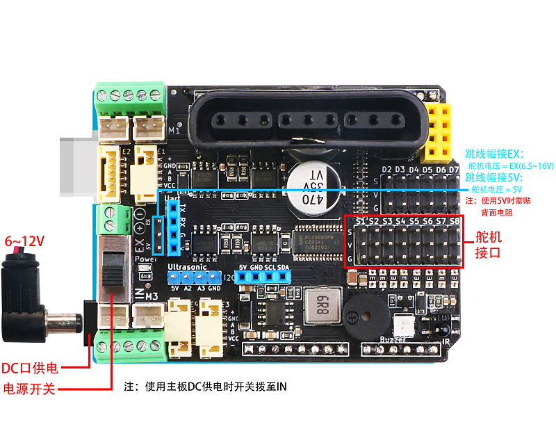
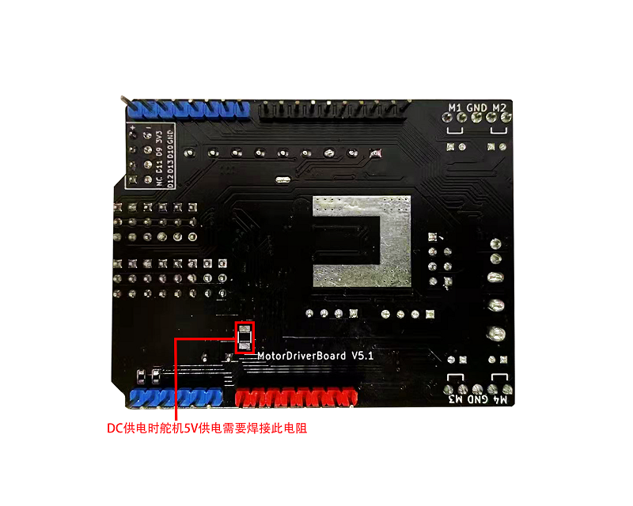
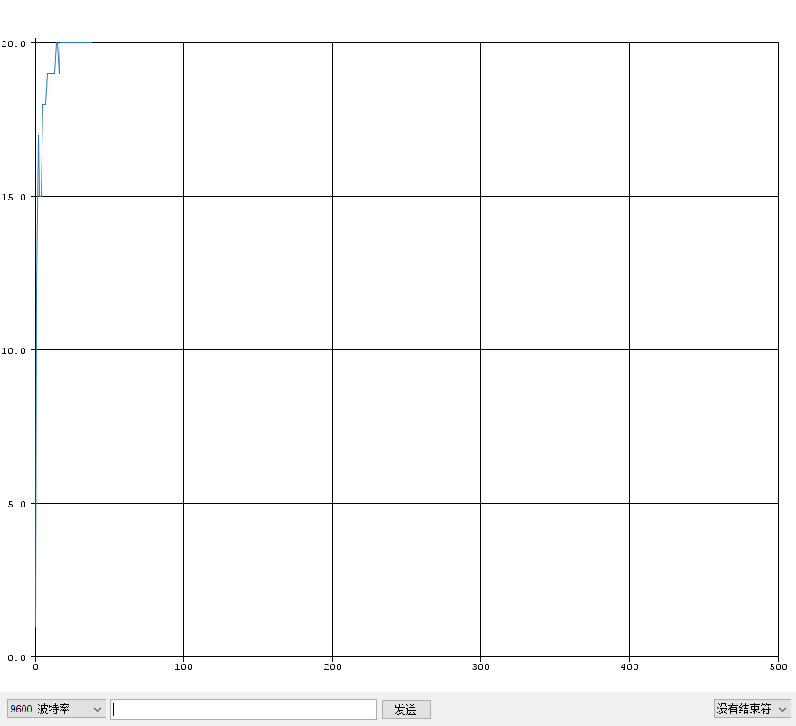

# MotorDriverBoard
[English](README.md) 中文版

MotorDriverBoard是由 [深圳市易创空间科技有限公司](www.emakefun.com)，专门针对Arduino Uno(兼容Mega2560)机器人，电机驱动，多路舵机控制而研发的一款多功能电机驱动扩展板。本驱动板采用I2C方式控制[PCA9685](./doc/pca9685.pdf)(16路PWM输出芯片)。所以本驱动板电机或者舵机和arduino主板IO口不存在对应关系，是通过I2C扩展PWM控制，详情请见[驱动板原理图](./doc/MotorDriverBoard_V5.1.pdf)。

MotorDriverBoard for Arduino  Uno(Arduino Mega2560) 


### 快速链接

[arduino ide库文件下载]()

[mixly库下载]()

[mblock5库下载]()

[mind+库下载]()

[MaigcBlock下载]()

## 特点

- 支持4路直流电机，最大驱动电流3A
- 支持驱动8路舵机，带自恢复保险丝，防止舵机堵转
- 支持驱动2路4线步进电机
- 支持4路编码电机
- 板载无源蜂鸣器
- 板载1个RGB全彩灯
- 板载红外接收头
- 1个 i2c接口 、1个PS2X接口、1个Uart(蓝牙/wifi模块)接口 、1个NRF24L01模块接口
- 1个超声波模块接口
- 舵机电源可切换到外部供电
- 软件支持Arduino IDE，Mixly，MagicBlock(Scratch3.0)


## 硬件功能介绍
### 正面


### 供电说明
- 通过Uno的DC（6~12）头单一电源供电，舵机供电

  **PS2控制9V以上的电机时，为了确保PS2不断连，建议使用航模电池或者大电流21700锂电池，两节18650供电有压力**


- 接线柱供电单一电源供电，需要焊接背面电阻位


- 舵机采用驱动板载DC-DC电源供电

 



- 舵机采用外部供电


## 驱动库使用

[下载arduino库]()放置Arduino IDE安装目录下的libraries目录下如下图


## 基础示例程序
[**gpio_test**](./arduino_lib/examples/base/gpio_test/gpio_test.ino) 控制PCA9685输出口当作普通IO口输出高低电平

```c++
gpio.begin(1000);  		/*初始化io口的输出频率为1KHz*/
gpio.setPin(S1, HIGH);  /*引脚S1(S1~S8)输出高电平*/
gpio.setPin(S1, LOW);  	/*引脚S1(S1~S8)输出低电平*/
```

  

[**pwm_test**](./arduino_lib/examples/base/pwm_test/pwm_test.ino) 这个示例程序为控制PCA9685输出口输出PWM波形

```c++
pwm.begin(1500);  			/*初始化io口的输出频率为1500Hz*/
pwm.setPin(S1, 1024); 		/*引脚1输出占空比为 1024/4096 的PWM波（0~4096）*/

[dc](examples/dc/dc.ino)	/*4路直流电机测试程序*/

mMotor.begin(50); 			/*初始化io口的输出频率为50Hz*/
DCMotor_1->setSpeed(200); 	/*设置速度为200*/
DCMotor_1->run(FORWARD); 
/*控制电机运行状态（FORWARD(前)、BACKWARD(后)、BRAKE(停止)）*/
```


**[ps2_test](./arduino_lib/examples/base/ps2_test/ps2_test.ino)**PS2手柄测试程序

PS2安装如下：


## 电机测试示例

[**dc**](./arduino_lib/examples/motor_test/dc/dc.ino)四路直流电机测试程序

```c++
Emakefun_MotorDriver mMotor = Emakefun_MotorDriver(0x60);
Emakefun_DCMotor *DCMotor_1 = mMotor.getMotor(M1);


void setup()
{
    Serial.begin(9600);
    mMotor.begin(50);
}

void loop()
{
  // 前进
  DCMotor_1->setSpeed(200);  //速度0~255
  DCMotor_1->run(FORWARD);   // 总共FORWARD前进，BACKWARD后退，BRAKE刹车 RELEASE释放四个状态
}
```

**接线图**


[**servo**](./arduino_lib/examples/motor_test/servo/servo.ino)八路舵机测试程序

```c++
mMotorDriver.begin(50); 		/*初始化io口的输出频率为50Hz*/
mServo1->writeServo(S1); 		/*设置舵机角度 0~180*/
```

**接线图**

[**stepper**](./arduino_lib/examples/motor_test/stepper/stepper.ino) 步进电机测试程序

```c++
Emakefun_StepperMotor *StepperMotor_1 = mMotorDriver.getStepper(1, 200);  
/*初始化步进电机1，42步进电机走一步是1.8度，所以一圈的步数为200*/

mMotorDriver.begin(1526); 			/*设置频率为最大 1526HZ*/

StepperMotor_1->setSpeed(400);  	/*设置步进电机每分钟转的圈数为400圈,速度越快力矩越小*/

StepperMotor_1->step(200, FORWARD, DOUBLE); 
/*驱动步进电机按 DOUBLE(全步)的方式，FORWARD（前进）200步。*/

  /*步进电机的驱动方式 全步DOUBLE、单步SINGLE、1/2步进INTERLEAVE这三种驱动方式（步进电机的驱动原理请查阅相关资料）。*/
```

**接线图**

[**encoder**](./arduino_lib/examples/motor_test/encoder/encoder.ino)4路直流电机测试程序

```c++
mMotorDriver.begin(); 				/*初始化io口的输出频率默认为最大*/
EncodeMotor_1->setSpeed(100); 		/*设置速度为100*/
EncodeMotor_1->run(BACKWARD);
/*控制电机运行状态（FORWARD(前)、BACKWARD(后)、BRAKE(停止)）*/
```

使用PID控制编码电机速度

```c++
PID myPID(&Input, &Output, &Setpoint, Kp, Ki, Kd, DIRECT);
```

- Input：PID的输入(编码电机速度)
- Output：PID的输出(编码电机速度)
- Setpoint：PID的目标值
- Kp：PID的比例系数
- Ki：PID的积分系数
- Kd：PID的微分系数
- DIRECT：方向参数，编码电机正转
- REVERSE：方向参数，编码电机反转

```c++
myPID.SetSampleTime(500); 			/*设置PID采样时间为 500ms*/
myPID.SetMode(AUTOMATIC);  			/*设置PID模式为AUTOMATIC*/
```

```c++
Emakefun_EncoderMotor *EncodeMotor_1 = mMotorDriver.getEncoderMotor(1); /*获取编码电机1*/
mMotorDriver.begin(); 				/*初始化io口的输出频率默认为最大*/
EncodeMotor_1->init(encoder1); 		/*初始化encoder1为编码电机1的回调函数(计算编码盘的脉冲)*/
MsTimer2::set(500, EncoderSpeed);  	/*定时器2定时获取编码电机速度*/
MsTimer2::start(); 					/*启动定时器2*/
```



**接线图**

编码电机我们使用的是6pin的GH1.25转PH2.0线材接线如下：


## 综合应用

[PS2控制四驱小车](./examples/ps2ControlCar/ps2ControlCar.ino)

[PS2控制四驱麦克纳姆轮小车](examples/ps2ControlMecanumWheel/ps2ControlMecanumWheel.ino)

[PS2控制四驱小车加机械臂](examples/ps2ControlCarAndRoboticArm/ps2ControlCarAndRoboticArm.ino)

[蓝牙(WIFI)控制四驱小车](./arduino_lib/examples/ble/ble.ino)

蓝牙或者wifi模块请使用数据透传模块，连接到arduino的硬件串口引脚上（0-RXD，1-TXD）

## 图像化编程块说明

### MotorDriverBoard 编程图形块
#### [mBlock5]()

#### 米思齐

#### MagicBlock


