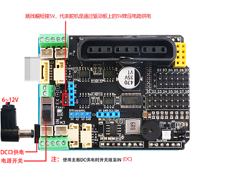

# MotorDriverBoard V5.2

[English](README.md) 中文版

MotorDriverBoard是由 [深圳市易创空间科技有限公司](www.emakefun.com)，专门针对Arduino Uno(兼容Mega2560)机器人，电机驱动，多路舵机控制而研发的一款多功能电机驱动扩展板。本驱动板采用I2C方式控制[PCA9685](./doc/pca9685.pdf)(16路PWM输出芯片)。所以本驱动板电机或者舵机和arduino主板IO口不存在对应关系，是通过I2C扩展PWM控制，详情请见[**驱动板原理图**](./doc/MotorDriverBoard_V5.1.pdf)。

**MotorDriverBoard for Arduino  Uno(Arduino Mega2560)**


### 快速链接

[**常见问题**](#FAQ)

[**arduino ide库文件下载**](https://github.com/emakefun/MotorDriverBoard/releases/download/v1.0/MotorDriverBoard.zip)

[mixly库下载](https://github.com/emakefun/MotorDriverBoard/releases/download/v1.0/MotorDriverBoard_Mixly.zip)

[mblock5库下载]()

[mind+库下载]()

[MaigcBlock下载]()

## 特点

- 支持4路直流电机，最大驱动电流3A
- 支持驱动8路舵机，带自恢复保险丝，防止舵机堵转
- 支持驱动2路4线步进电机
- 支持4路编码电机
- 板载无源蜂鸣器(**A0**)
- 板载1个RGB全彩灯(**A1**)
- 1个 i2c接口 、1个PS2X接口、1个Uart(蓝牙/wifi模块)接口 、1个NRF24L01无线模块接口
- 1个超声波模块接口
- 舵机电源可切换到外部供电
- 软件支持Arduino IDE，Mixly，Mind+，Mblock5，MagicBlock(基于Scratch3.0可定制)


## 硬件功能介绍
### 正面


### 供电说明

为了将本驱动板做到使用更加灵活，适应不同电机，舵机驱动要求，以及整个板子能够稳定运行

我们设计了如下几种供电方案，**注意驱动板必须通过锂电池或者8.4V 3A以上的UPS电源供电，不能只Uno主板usb供电或者干电池供电**


#### 1、只通过Uno的DC（7~12V）头单一电源给Uno主板，驱动板，舵机同时供电。

  应用场景:

  a、**驱动9V以下得直流电机比如TT马达积木电机灯，外加sg90/mg90这种舵机**；

  b、**PS2控制9V~12V的电机时，为了确保PS2不断连，建议使用航模电池或者大电流21700锂电池，两节18650供电不稳定**。

  c、电源切换开关达到**IN(DC)**位置，跳线帽**短接5V位置**



#### 2、只通过接线柱供单一电源给驱动板，Uno主板和舵机供电。将驱动板的5V电源输出到Uno主板

  适应场景

  a、驱动4路12V以上的电机时比如370电机，520电机，此时舵机为sg90/mg90这种小功率舵机;

  b、供电超过Uno DC头12V电压，所以我们需要用接线柱供电，供电范围6~25V;

  c、电源切换开关打到**EX**，跳线帽短接到**5V位置**，需要短接背面**R24电阻位**。


#### 3、Uno主板通过DC头供电，舵机通过接线柱独立供电

  a、外部使用MG995/MG996/DS3235/DS3238等大力矩舵机时，数量超过2个时（需要根据实际情况测试），我们需要给舵机独立供电

  b、舵机供电电压电流根据舵机参数提供

  c、电源切换开关达到**IN(DC)**位置，跳线帽**短接EX位置**


## 驱动库使用

[**下载arduino库**]()放置Arduino IDE安装目录下的libraries目录下，然后从文件-->示例-->Emakefun_MotorDriverBoard


## 基础示例程序
[**gpio_test**](./arduino_lib/examples/base/gpio_test/gpio_test.ino) 控制PCA9685输出口当作普通IO口输出高低电平

```c++
Emakefun_MotorDriver gpio = Emakefun_MotorDriver(0x60);

gpio.begin(1000);  		/*初始化io口的输出频率为1KHz*/
gpio.setPin(S1, HIGH);  /*引脚S1(S1~S8)输出高电平*/
gpio.setPin(S1, LOW);  	/*引脚S1(S1~S8)输出低电平*/
```

  

[**pwm_test**](./arduino_lib/examples/base/pwm_test/pwm_test.ino) 这个示例程序为控制PCA9685输出口输出PWM波形

```c++
Emakefun_MotorDriver pwm = Emakefun_MotorDriver(0x60);
pwm.begin(1500);  			/*初始化io口的输出频率为1500Hz*/
pwm.setPin(S1, 1024); 		/*引脚1输出占空比为 1024/4096 的PWM波（0~4096）*/
```


**[ps2_test](./arduino_lib/examples/base/ps2_test/ps2_test.ino)**PS2手柄测试程序

PS2手柄引脚说明：

| PS2手柄引脚 | Arduino引脚 |
| ----------- | ----------- |
| DAT         | D12         |
| CMD         | D11         |
| SEL/ATT     | D10         |
| CLK         | D13         |

PS2安装请勿接反，左边是正确安装，右边为PS2接收器接反


## 电机测试示例

#### [**dc**](./arduino_lib/examples/motor_test/dc/dc.ino)四路直流电机测试程序

```c++
Emakefun_MotorDriver mMotor = Emakefun_MotorDriver(0x60);
Emakefun_DCMotor *DCMotor_1 = mMotor.getMotor(M1);

void setup()
{
    Serial.begin(9600);
    mMotor.begin(50);   /*初始化io口的输出频率为50Hz*/
}

void loop()
{
  // 前进
  DCMotor_1->setSpeed(200);  /*设置速度为200 范围0~255 */
  DCMotor_1->run(FORWARD);   // 总共FORWARD前进，BACKWARD后退，BRAKE刹车 RELEASE释放四个状态
}
```

**接线图**


#### [**servo**](./arduino_lib/examples/motor_test/servo/servo.ino)八路舵机测试程序

```c++
Emakefun_MotorDriver mMotorDriver = Emakefun_MotorDriver(0x60);
Emakefun_Servo *mServo1 = mMotorDriver.getServo(1);
mMotorDriver.begin(50); 		/*初始化io口的输出频率为50Hz*/
mServo1->writeServo(S1); 		/*设置舵机角度 0~180*/
```

**接线图**

#### [**stepper**](./arduino_lib/examples/motor_test/stepper/stepper.ino) 步进电机测试程序

```c++
Emakefun_MotorDriver mMotorDriver = Emakefun_MotorDriver(0x60);
Emakefun_StepperMotor *StepperMotor_1 = mMotorDriver.getStepper(1, 200);  
/*初始化步进电机1，42步进电机走一步是1.8度，所以一圈的步数为200*/

mMotorDriver.begin(1600); 		/*设置频率为最大 1600*/

StepperMotor_1->setSpeed(400);  /*设置步进电机每分钟转的圈数为400圈, 速度越快力矩越小，这个速度不能太低，否则会抖动严重*/

StepperMotor_1->step(200, FORWARD, SINGLE); 
/*驱动步进电机按 DOUBLE(全步)的方式，FORWARD（前进）200步。*/

/*步进电机的驱动方式 全步DOUBLE、单步SINGLE、1/2步进INTERLEAVE这三种驱动方式（步进电机的驱动原理请查阅相关资料）*/
```

**接线图**

**不同步进电机的参数接线不一定一样，请一定要先确定步进电机每根线的颜色和对应A+ A- B+ B-相位（或者是A B C D）关系**

下图仅供接线参考


#### [**encoder**](./arduino_lib/examples/motor_test/encoder/encoder.ino)四路编码电机测试程序

编码器关键参数如下：

| 类型         | 参数                                                         |
| ------------ | ------------------------------------------------------------ |
| 转速         | 电压6V  空载电流70mA  空载轮轴转速90RPM<br />电压9V  空载电流150mA  空载轮轴转速140RPM<br />电压12V  空载电流190mA  空载轮轴转速190RPM |
| 输出方波类型 | AB相方波                                                     |
| 基础脉冲     | 12PPR(电机转动一圈输出12个脉冲)                              |
| 减速比       | 1:90(转轴转动一圈电机转动90圈)                               |

通过上面参数可知，轮子旋转一圈，总共需要计数90x12=1080个脉冲

```c++
mMotorDriver.begin(); 				/*初始化io口的输出频率默认为最大*/
EncodeMotor_1->setSpeed(100); 		/*设置速度为100*/
EncodeMotor_1->run(BACKWARD);
/*控制电机运行状态（FORWARD(前)、BACKWARD(后)、BRAKE(停止)）*/
```

测试四个编码电机都都能够旋转，打开串口我们要能打印出Encoder1Pulse，Encoder2Pulse，Encoder3Pulse，Encoder4Pulse四个脉冲值如下，证明编码电机都是正常工作的。

```c++
start
Encoder1Pulse:1
Encoder2Pulse:1
Encoder3Pulse:1
Encoder4Pulse:1
Encoder1Pulse:2
Encoder2Pulse:2
Encoder1Pulse:3
```

[**encoder_pid**](./arduino_lib/examples/motor_test/encoder_pid/encoder_pid.ino)编码电机PID控制电机速度

```c++
PID myPID(&Input, &Output, &Setpoint, Kp, Ki, Kd, DIRECT);
```

- Input：PID的输入(编码电机速度)
- Output：PID的输出(编码电机速度)
- Setpoint：PID的目标值
- Kp：PID的比例系数
- Ki：PID的积分系数
- Kd：PID的微分系数
- DIRECT：方向参数，编码电机正转
- REVERSE：方向参数，编码电机反转

```c++
myPID.SetSampleTime(100); 			/*设置PID采样时间为100ms*/
myPID.SetMode(AUTOMATIC);  			/*设置PID模式为AUTOMATIC*/
```

```c++
Emakefun_EncoderMotor *EncodeMotor_1 = mMotorDriver.getEncoderMotor(1); /*获取编码电机1*/
mMotorDriver.begin(); 				/*初始化io口的输出频率默认为最大*/
EncodeMotor_1->init(encoder1); 		/*初始化encoder1为编码电机1的回调函数(计算编码盘的脉冲)*/
MsTimer2::set(100, EncoderSpeed);  	/*定时器2定时获取编码电机速度*/
MsTimer2::start(); 					/*启动定时器2*/
```

**注意**

由于我们测试使用的是8.4V锂电池，大部分电池电压在7\~8V之间，我们实际测速只有100RPM，采样时间为100ms，那么计算出每个周采样周期的最大采样脉冲数为100x90x12x(0.1s)/60=180Pluse/samptime。被控制量的范围为0\~255，得出采样比例系数为ratio = 255/180 = 1.5。这个比例参数是可以自己定义的，你们可以根据自己的习惯来定义，我这个测试程序为了方便理解，把目标值和PWM控制量0\~255关联起来，即控制目标范围也为0\~255。

**第一步：纯比例作用整定**

由于是第一次进行PID参数整定，电机速度整定到100为目标，在程序中输入设定值。先把系统设定为纯比例作用，即只有比例增益Kp不为0，积分增益Ki和微分增益Kd都暂时设定为0。因为是这个小车第一次整定参数，也不知道什么比例增益比较好。比例作用从弱到强调节，随便写了个自认为不大的值3，**打开工具-->串口绘图器**。运行结果令我大吃一惊，电机以一定的周期在转和不转之间震荡。根据现象得知，肯定是比例作用已经非常大了，因此赶紧将比例增益调整为2，小车的电机不再出现剧烈的“抽搐”，开始以一种比较缓慢的姿态转动，但通过观察输出波形，还是存在较小的波动，并且经过1，2分钟之后，还是会有大幅度震荡。但与之前较大比例作用下的震荡相比，显然“温柔”多了。于是继续降低比例作用，直至Kp = 1时，输出波形已经相较其他参数下稳定很多了，如下图：


**第二步：比例积分作用**

由上图可看出，一个适合的比例作用可以使系统趋于稳定，但却无法消除静态偏差，因此需要引入积分作用，其最大的好处就是可以消除静态偏差。笔者继续采用由小逐渐加大积分增益的方式。当设定Ki = 5时，由图可见


静态偏差逐渐减小，输出的速度越来越接近设定的速度100的目标，不过调节速度太慢，还是不能满足需求。
于是还需要继续加积分作用，当Ki = 6时，可以看出，系统反应速度已经很快，可以在0.1秒内


**接线图**

编码电机我们使用的是6pin的GH1.25转PH2.0线材接线如下：


## 综合应用

[PS2控制四驱小车](./examples/ps2ControlCar/ps2ControlCar.ino)

[PS2控制四驱麦克纳姆轮小车](examples/ps2ControlMecanumWheel/ps2ControlMecanumWheel.ino)

[PS2控制四驱小车加机械臂](examples/ps2ControlCarAndRoboticArm/ps2ControlCarAndRoboticArm.ino)

[蓝牙(WIFI)控制四驱小车](./arduino_lib/examples/ble/ble.ino)

蓝牙或者wifi模块请使用数据透传模块，连接到arduino的硬件串口引脚上（0-RXD，1-TXD）

## 图像化编程块说明

### MotorDriverBoard 编程图形块
#### [mBlock5]()


#### 米思齐

#### MagicBlock


## FAQ
####  Q：驱动板arduino IO对应关系?
##### A ：本驱动板采用I2C方式控制[PCA9685](./doc/pca9685.pdf)(16路PWM输出芯片)。所以本驱动板电机或者舵机和arduino主板IO口不存在对应关系，是通过I2C扩展PWM控制

####  Q：驱动板该如何接电?
##### A ：请先判断手里是用什么电源，驱动什么样的电机，需要多大电压和电流，还有舵机，然后根据实际情况采用对应的电池，不建议使用干电池供电

####  Q：驱动板驱动不了电机?
##### A ：请先判断驱动板是否有供电，并且开关有打开，只通过usb口供电是驱动不了电机的，另外主板还得烧录对应的驱动程序

####  Q：PS2遥控不了驱动板?
##### A ：在使用驱动板的时候，如果是新手用户，请一定要一步步来熟悉使用，不要一上来就全部功能一起使用，然后问的问题很大。针对这个问题需要做如下三个测试才行
a、驱动板是否使用7V以上锂电池供电且正常，板子上灯是否亮
b、下载直流电机驱动测试程序**确保要上传成功**，电机接线正确，来确定板子驱动正常
c、测试PS2接收测试程序，来证明PS2遥控器是好的
d、前面正确后下载PS2控制四驱小车程序，并按按键控制电机

####  Q：驱动板是否有原理图?
##### A ：有，点击这里[**驱动板原理图**](./doc/MotorDriverBoard_V5.1.pdf)。

####  Q：如何分析并判断驱动板是否损坏?

##### A ：先外观判断是否有芯片烧黑，冒烟，等情况。如果已经很熟练操作此板子，如果程序下载正确，供电也正确，板子就是驱动不了电机，那么有三种情况

1、电源切换开关接触不良，用万用表点一下确定，检测是否有5V电源输出

2、4个直流电机里面其中一部分转，一部分不转，有可能对应的驱动芯片烧坏

3、四个电机，舵机都不转，使用I2C 扫描程序测试，看是否能扫描到PCA968A的I2C地址，如果扫描不到PCA8685损坏
