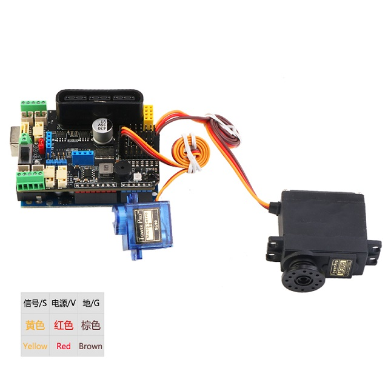

# MotorDriverBoard
[English](README.md) 中文版

MotorDriverBoard是由 [深圳市易创空间科技有限公司](www.emakefun.com)，专门针对Arduino Uno(兼容Mega2560)机器人，电机驱动，多路舵机控制而研发的一款多功能电机驱动扩展板。本驱动板采用I2C方式控制[PCA9685](./doc/pca9685.pdf)(16路PWM输出芯片)。所以本驱动板电机或者舵机不存在和arduino口的对应关系，是通过I2C扩展PWM控制，详情请见[驱动板原理图](./doc/MotorDriverBoard_V5.1.pdf)。

MotorDrvierBoard for Arduino  UNO(Arduino Mega2560) 


## 特点
- 支持4路直流电机，最大驱动电流3A
- 支持驱动8路舵机，带自恢复保险丝，防止舵机堵转
- 支持驱动2路4线步进电机
- 支持4路编码电机
- 板载无源蜂鸣器
- 板载1个RGB全彩灯
- 板载红外接收头
- 1个 i2c接口 、1个PS2X接口、1个Uart(蓝牙/wifi模块)接口 、1个NRF24L01模块接口
- 1个超声波模块接口
- 舵机电源可切换到外部供电
- 软件支持Arduino IDE，Mixly，MagicBlock(Scratch3.0)


## 硬件功能介绍
### 正面


### 供电说明
- DC头供电


- 接线柱供电


- 舵机采用驱动板载DC-DC电源供电

 


- 舵机采用外部供电


## 驱动库使用


## 基础示例程序
[**gpiotest**](examples/gpiotest/gpiotest.ino) 控制PCA9685输出口当作普通IO口输出高低电平

```c++
gpio.begin(1000);  		/*初始化io口的输出频率为1KHz*/
gpio.setPin(S1, HIGH);  /*引脚S1(S1~S8)输出高电平*/
gpio.setPin(S1, LOW);  	/*引脚S1(S1~S8)输出低电平*/
```

  

[**pwmtest**](examples/pwmtest/pwmtest.ino) 这个示例程序为控制PCA9685输出口输出PWM波形

```c++
pwm.begin(1500);  			/*初始化io口的输出频率为1500Hz*/
pwm.setPin(S1, 1024); 		/*引脚1输出占空比为 1024/4096 的PWM波（0~4096）*/

[dc](examples/dc/dc.ino)	/*4路直流电机测试程序*/

mMotor.begin(50); 			/*初始化io口的输出频率为50Hz*/
DCMotor_1->setSpeed(200); 	/*设置速度为200*/
DCMotor_1->run(FORWARD); 
/*控制电机运行状态（FORWARD(前)、BACKWARD(后)、BRAKE(停止)）*/
```

**接线图**

[**servo**](examples/servo/servo.ino)八路舵机测试程序

```c++
mMotorDriver.begin(50); 		/*初始化io口的输出频率为50Hz*/
mServo1->writeServo(0); 		/*设置舵机角度 0~180*/
```

**接线图**

**接线图**

[**stepper**](examples/stepper/stepper.ino) 步进电机测试程序

```c++
Emakefun_StepperMotor *StepperMotor_1 = mMotorDriver.getStepper(1, 200);  
/*初始化步进电机1，42步进电机走一步是1.8度，所以一圈的步数为200*/

mMotorDriver.begin(1526); 			/*设置频率为最大 1526HZ*/

StepperMotor_1->setSpeed(400);  	/*设置步进电机每分钟转的圈数为400圈*/

StepperMotor_1->step(200, FORWARD, DOUBLE); 
/*驱动步进电机按 DOUBLE(全步)的方式，FORWARD（前进）200步。*/

  /*步进电机的驱动方式 全步DOUBLE、单步SINGLE、1/2步进INTERLEAVE、1/16步进MICROSTEP这四种驱动方式（步进电机的驱动原理请查阅相关资料）。建议用1/16步进的模式。*/
```

**接线图**

[**encoder**](examples/encoder/encoder.ino)4路直流电机测试程序

```c++
mMotorDriver.begin(); 				/*初始化io口的输出频率默认为最大*/
EncodeMotor_1->setSpeed(100); 		/*设置速度为100*/
EncodeMotor_1->run(BACKWARD);
/*控制电机运行状态（FORWARD(前)、BACKWARD(后)、BRAKE(停止)）*/
```

使用PID控制编码电机速度

```c++
PID myPID(&Input, &Output, &Setpoint, Kp, Ki, Kd, DIRECT);
```

- Input：PID的输入(编码电机速度)
- Output：PID的输出(编码电机速度)
- Setpoint：PID的目标值
- Kp：PID的比例系数
- Ki：PID的积分系数
- Kd：PID的微分系数
- DIRECT：方向参数，编码电机正转
- REVERSE：方向参数，编码电机反转

```c++
myPID.SetSampleTime(500); 			/*设置PID采样时间为 500ms*/
myPID.SetMode(AUTOMATIC);  			/*设置PID模式为AUTOMATIC*/
```

```c++
Emakefun_EncoderMotor *EncodeMotor_1 = mMotorDriver.getEncoderMotor(1); /*获取编码电机1*/
mMotorDriver.begin(); 				/*初始化io口的输出频率默认为最大*/
EncodeMotor_1->init(encoder1); 		/*初始化encoder1为编码电机1的回调函数(计算编码盘的脉冲)*/
MsTimer2::set(500, EncoderSpeed);  	/*定时器2定时获取编码电机速度*/
MsTimer2::start(); 					/*启动定时器2*/
```


**接线图**

## 综合应用

[PS2控制四驱小车](examples/ps2ControlCar/ps2ControlCar.ino)

[PS2控制四驱麦克纳姆轮小车](examples/ps2ControlMecanumWheel/ps2ControlMecanumWheel.ino)

[PS2控制四驱小车加机械臂](examples/ps2ControlCarAndRoboticArm/ps2ControlCarAndRoboticArm.ino)

[蓝牙（WIFI）控制四驱小车](examples/ble/ble.ino)

## 图像化编程块说明

### MotorDriverBoard 编程图形块
#### [mBlock5]()

#### 米思齐

#### MagicBlock


